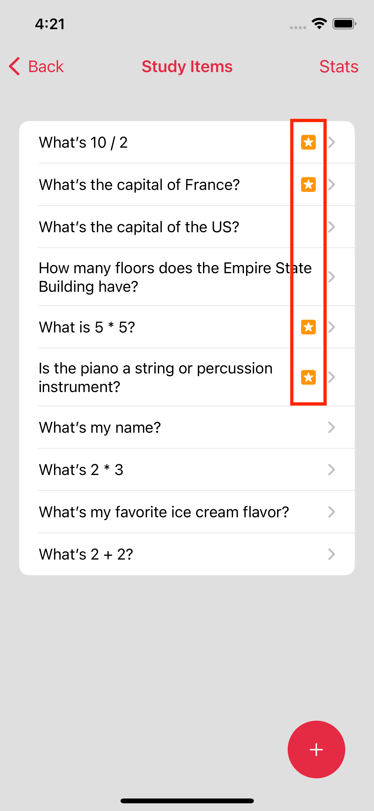

# Memre API Learning App

Example iOS app written using SwiftUI. Demonstrates a learning app that uses the Memre Learning Engine API to enhance the learning experience by recommending what to study.

[Memre Learning Engine API Documentation](https://rapidapi.com/memre-memre-default/api/learning-engine/)

Example calls to the Memre Learning Engine api can be found in [MemreLearningEngine.swift](LearningApp/api/MemreLearningEngine.swift).

## Learning Engine Integration Guide:

1. Obtain a RapidAPI key: [RapidAPI sign-up](https://rapidapi.com/auth/sign-up?referral=/memre-memre-default/api/learning-engine/pricing)

2. Use the RapidAPI key to make api calls to the Memre Learning Engine

https://github.com/ceregousa/ios_memre_api_app/blob/ee024191b38672b6ea703b9d6927727065b1847a/LearningApp/MyUserDefaults.swift#L6-L9

https://github.com/ceregousa/ios_memre_api_app/blob/1c7a5968b944b2d60301670a7f154b0777a036b3/LearningApp/api/MemreLearningEngine.swift#L201-L216

3. Create a Learning Engine User and store the user id to use with subsequent api calls for the user of the learning app.

https://github.com/ceregousa/ios_memre_api_app/blob/7c18c7cc83930993ef8746f5363a17cc031d3a83/LearningApp/screens/EnterAPIKeyView.swift#L27-L29

https://github.com/ceregousa/ios_memre_api_app/blob/9ad888c2bcfce414aa6d29c201e99f50b865c745/LearningApp/api/MemreLearningEngine.swift#L10-L39

4. Create a Learning Engine Item and associate the item id to each study item in the app.

https://github.com/ceregousa/ios_memre_api_app/blob/9ad888c2bcfce414aa6d29c201e99f50b865c745/LearningApp/api/MemreLearningEngine.swift#L41-L71

https://github.com/ceregousa/ios_memre_api_app/blob/32a492c8baddc9c9997d4beecd8dcd8c6537698d/LearningApp/screens/AddStudyItemView.swift#L72-L82

5. Post a study report whenever the user studies a learning item.

https://github.com/ceregousa/ios_memre_api_app/blob/3d15732fd0a490cd15c60f1176f80ad18684175b/LearningApp/screens/StudyQuizView.swift#L64-L73

6. Use the Learning Engine recommendations to suggest which items to study.

https://github.com/ceregousa/ios_memre_api_app/blob/2c62b3a7d3ec46bc00c1cf5428b200dd3cbb3785/LearningApp/screens/StudyItemsView.swift#L73-L84

https://github.com/ceregousa/ios_memre_api_app/blob/9ad888c2bcfce414aa6d29c201e99f50b865c745/LearningApp/view/StudyItemCell.swift#L20-L26
